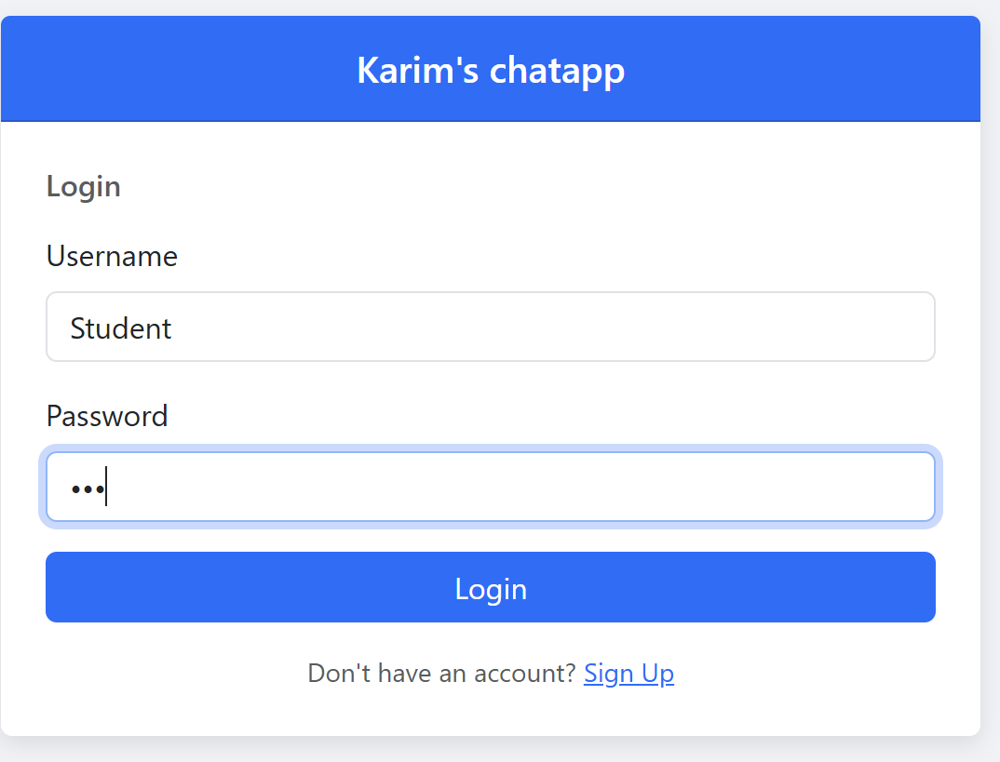
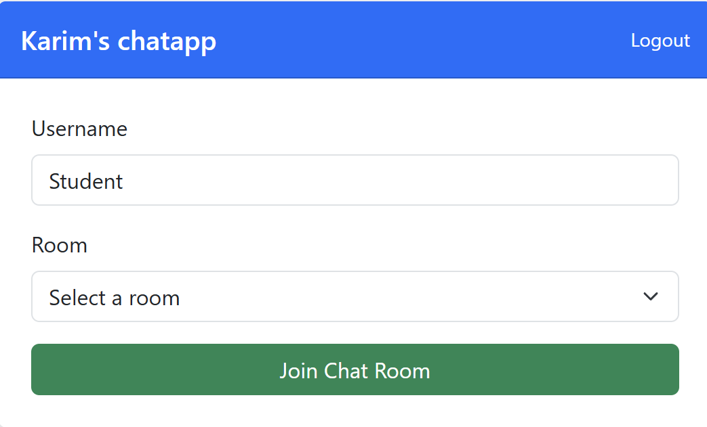
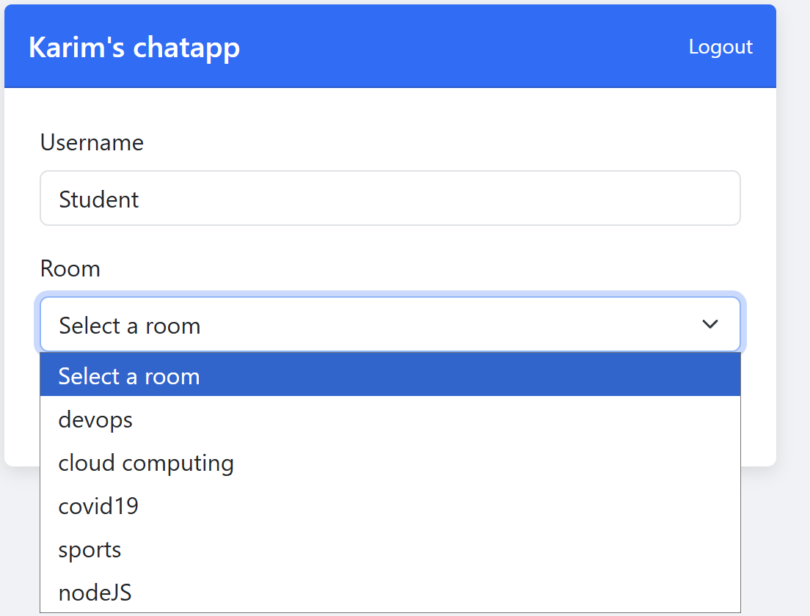
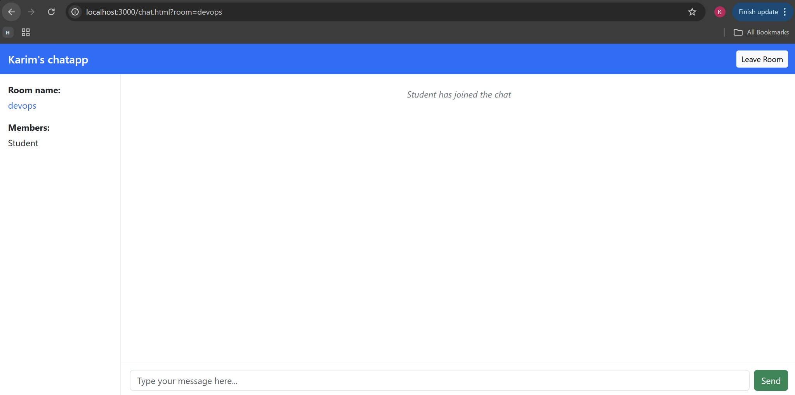
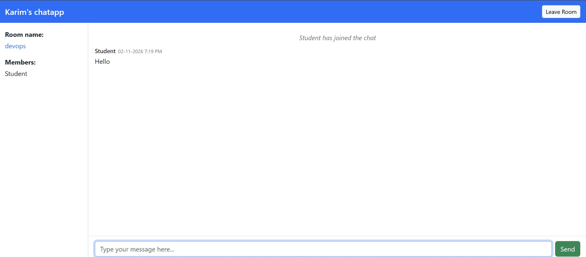

# COMP 3133 - Lab Test 1: Chat Application

## Technologies
- **Backend:** Node.js, Express, Socket.io, Mongoose
- **Frontend:** HTML5, CSS, Bootstrap, fetch, jQuery

## Features

### Signup
Create an account. User data is stored in MongoDB.

### Login
Login page. Session is stored in `localStorage`.

### Join / Leave rooms
Join any room from the list (devops, cloud computing, covid19, sports, nodeJS). Logout in the header.

### Room selection
Dropdown with predefined rooms.

### Room-based chat
Real-time chat via Socket.io. Messages only in the current room.

### Messages in MongoDB
Group messages are saved in MongoDB.

### Typing indicator
Shows "Username is typing..." when someone is typing.

## Setup
1. Install dependencies: `npm install`
2. Start MongoDB locally (or set `MONGODB_URI`).
3. Run the server: `npm start`
4. Open http://localhost:3000
